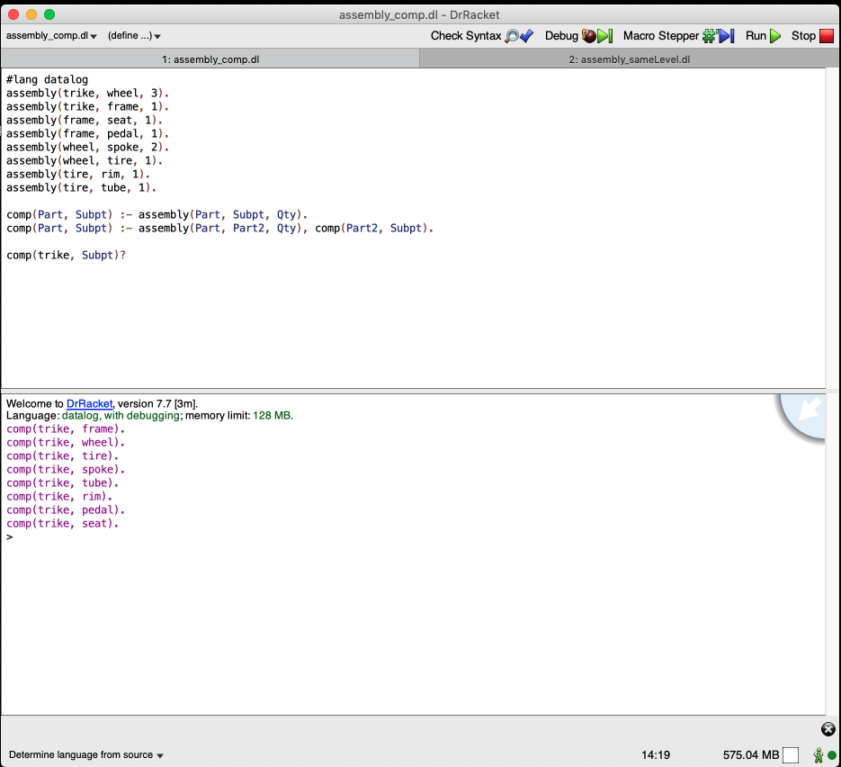
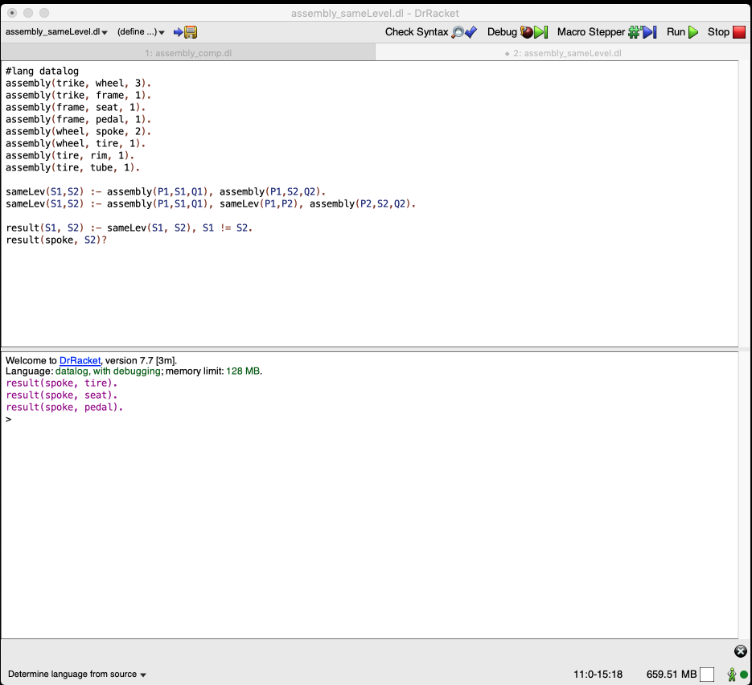

## SQL v. Datalog v. Cypher

In this document, we use a simple table shown below to compare
SQL, Datalog, and Cypher queries.

The working table

| Part  | Subpart | number |
|-------|---------|--------|
| trike | wheel   |  3     |
| trike | frame   | 1      |
| frame | seat    | 1      |
| frame | pedal   | 2      |
| wheel | spoke   | 2      |
| wheel | tire    | 1      |
| tire  | rim     | 1      |
| tire  | tube    | 1      |

## SQL

We use PostgreSQL 12 for our experiment. 


## Datalog

We use [DrRacket](https://docs.racket-lang.org/datalog/Tutorial.html?q=datalog) for this section.

1. Create the table:

    ```racket-lang
    assembly(trike, wheel, 3).
    assembly(trike, frame, 1).
    assembly(frame, seat, 1).
    assembly(frame, pedal, 1).
    assembly(wheel, spoke, 2).
    assembly(wheel, tire, 1).
    assembly(tire, rim, 1).
    assembly(tire, tube, 1).
    ```
    
1. Create datalog rules to get all the components of "trike":

    ```racket-lang
    comp(Part, Subpt) :- assembly(Part, Subpt, Qty).
    comp(Part, Subpt) :- assembly(Part, Part2, Qty), comp(Part2, Subpt).
    comp(trike, Subpt)?
    ```
    
   


1. Get the components at the same level as "spoke":

    ```racket-lang
    sameLev(S1,S2) :- assembly(P1,S1,Q1), assembly(P1,S2,Q2).
    sameLev(S1,S2) :- assembly(P1,S1,Q1), sameLev(P1,P2), assembly(P2,S2,Q2).
    
    result(S1, S2) :- sameLev(S1, S2), S1 != S2.
    result(spoke, S2)?
    ```
    
    


## Cypher

We use [neo4j sandbox](https://sandbox.neo4j.com/) for this section.


1. Create a blank sandbox
1. First create a graph:

    ```Cypher
    CREATE 
    (trike:Part {name: "trike"}),
    (wheel:Part {name: "wheel"}),
    (frame:Part {name: "frame"}),
    (spoke:Part {name: "spoke"}),
    (tire:Part {name: "tire"}),
    (seat:Part {name: "seat"}),
    (pedal:Part {name: "pedal"}),
    (rim:Part {name: "rim"}),
    (tube:Part {name: "tube"}),
    (wheel)-[:SUBPART_OF]->(trike),
    (frame)-[:SUBPART_OF]->(trike),
    (spoke)-[:SUBPART_OF]->(wheel),
    (tire)-[:SUBPART_OF]->(wheel),
    (seat)-[:SUBPART_OF]->(frame),
    (pedal)-[:SUBPART_OF]->(frame),
    (rim)-[:SUBPART_OF]->(tire),
    (tube)-[:SUBPART_OF]->(tire);
    ```
    
    The graph looks like:
    
    

1. Get all the components of "trike":

    ```Cypher
    MATCH (n:Part)-[:SUBPART_OF*]->(p:Part {name:"trike"}) RETURN n.name
    ```
    
   

1. Get the components at the same level as "spoke":

    ```Cypher
    MATCH p1 = (n:Part)-[:SUBPART_OF*]->(p:Part)
    MATCH p2 = (m:Part)-[:SUBPART_OF*]->(p:Part)
    WHERE length(p1) = length(p2) AND m.name <> n.name AND n.name = "spoke"
    RETURN DISTINCT n,m
    ```
    
    
