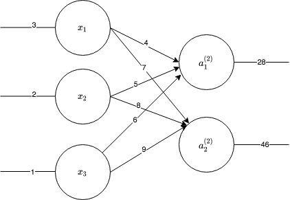
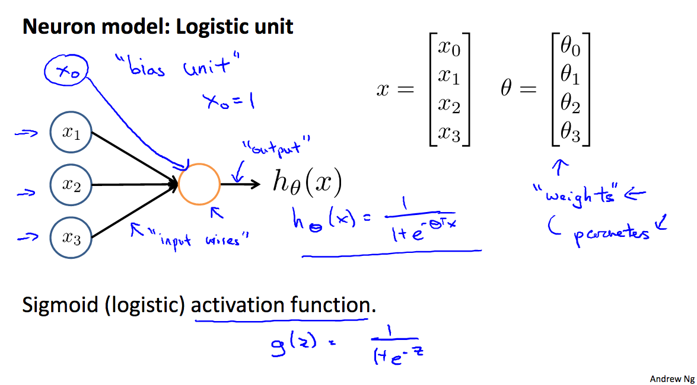
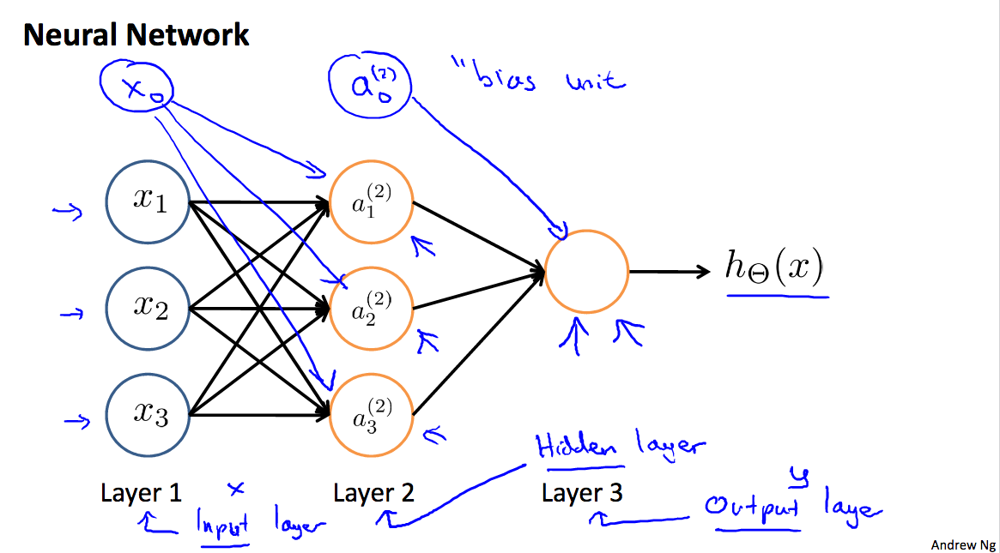

## Notes

For p3, `layer` function, for example, with 

```
(layer (list 3 2 1) (list (list 4 5 6) (list 7 8 9)))
```

Implements a layer showing below



Quickly recap neural nets from Coursera Andrew Ng's ML Lecture 8:





### Reference on Rosette

- https://www.cs.utexas.edu/~bornholt/post/building-synthesizer.html
- https://homes.cs.washington.edu/~emina/media/cav19-tutorial/part1.html
- https://homes.cs.washington.edu/~emina/media/cav19-tutorial/part2.html
- https://gist.github.com/jamesbornholt/b51339fb8b348b53bfe8a5c66af66efe